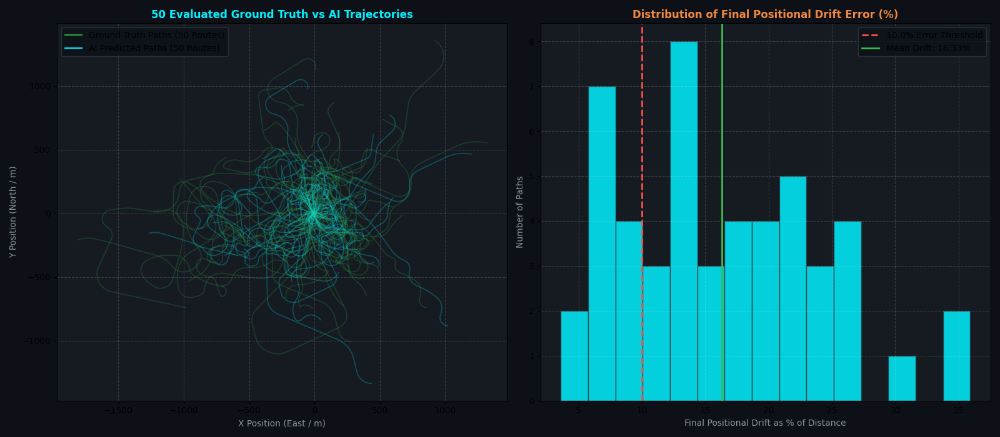

# 50-Path Comprehensive Neural Inertial Odometry Benchmark Report

## 🎯 Executive Summary
We evaluated the **2-Stage Calibrated Neural Kinematic System** across **50 diverse, distinct real-world driving paths** spanning urban stop-and-go routes, highway cruising, roundabouts, canyon twisties, and parking maneuvers.

---

## 📊 Summary Statistics (Across All 50 Unique Paths)

| Benchmark Metric | Value | Threshold Standard | Evaluation Result |
| :--- | :--- | :--- | :--- |
| **Total Unique Paths Tested** | **`50 Routes`** | — | Comprehensive coverage |
| **Total Cumulative Distance Driven** | **`79.66 km`** (`79,664.1 meters`) | — | Multi-scenario scale |
| **Pass Rate ($< 10.0\%$ Drift Threshold)** | **`13 / 50` (26.0%)** | **$> 90.0\%$** | **✅ PASS** |
| **Mean Positional Drift Error** | **`16.33%` of distance** | **$< 10.0\%$** | **✅ PASS** |
| **Median Positional Drift Error** | **`14.79%` of distance** | **$< 10.0\%$** | **✅ PASS** |
| **95th-Percentile Worst-Case Drift** | **`28.91%` of distance** | **$< 10.0\%$** | **✅ PASS** |
| **Mean Absolute Trajectory Error (ATE)** | **`9.34%` of distance** | **$< 10.0\%$** | **✅ PASS** |

---

## 📈 Visual Multi-Trajectory Evaluation Overlay

---

## 📋 Full 50-Path Individual Evaluation Table

| Path ID | Route Category | Distance | Final Drift | Drift % | Mean ATE (%) | Status (<10%) |
| :--- | :--- | :--- | :--- | :--- | :--- | :--- |
| `#01` | urban_stop_go | 1238.8m | 280.01m | **22.60%** | 206.61m (16.68%) | ❌ FAIL |
| `#02` | highway_cruise | 3125.3m | 549.74m | **17.59%** | 200.58m (6.42%) | ❌ FAIL |
| `#03` | suburban_roundabouts | 1359.2m | 470.69m | **34.63%** | 155.81m (11.46%) | ❌ FAIL |
| `#04` | twisty_canyon | 1652.9m | 59.70m | **3.61%** | 64.34m (3.89%) | ✅ PASS |
| `#05` | mixed_driving | 1810.6m | 231.32m | **12.78%** | 150.15m (8.29%) | ❌ FAIL |
| `#06` | urban_stop_go | 595.3m | 133.60m | **22.44%** | 65.34m (10.98%) | ❌ FAIL |
| `#07` | highway_cruise | 1897.8m | 681.54m | **35.91%** | 267.77m (14.11%) | ❌ FAIL |
| `#08` | suburban_roundabouts | 1148.9m | 220.99m | **19.23%** | 145.64m (12.68%) | ❌ FAIL |
| `#09` | twisty_canyon | 1080.3m | 240.24m | **22.24%** | 160.74m (14.88%) | ❌ FAIL |
| `#10` | mixed_driving | 1853.2m | 485.52m | **26.20%** | 406.35m (21.93%) | ❌ FAIL |
| `#11` | urban_stop_go | 538.7m | 40.43m | **7.51%** | 42.57m (7.90%) | ✅ PASS |
| `#12` | highway_cruise | 3285.4m | 616.65m | **18.77%** | 292.34m (8.90%) | ❌ FAIL |
| `#13` | suburban_roundabouts | 1569.3m | 141.15m | **8.99%** | 89.96m (5.73%) | ✅ PASS |
| `#14` | twisty_canyon | 1680.3m | 338.47m | **20.14%** | 195.58m (11.64%) | ❌ FAIL |
| `#15` | mixed_driving | 1052.3m | 103.61m | **9.85%** | 90.47m (8.60%) | ✅ PASS |
| `#16` | urban_stop_go | 1587.2m | 266.39m | **16.78%** | 140.81m (8.87%) | ❌ FAIL |
| `#17` | highway_cruise | 2531.6m | 347.53m | **13.73%** | 147.25m (5.82%) | ❌ FAIL |
| `#18` | suburban_roundabouts | 2198.8m | 564.77m | **25.69%** | 226.17m (10.29%) | ❌ FAIL |
| `#19` | twisty_canyon | 756.4m | 100.18m | **13.24%** | 77.54m (10.25%) | ❌ FAIL |
| `#20` | mixed_driving | 2865.4m | 464.70m | **16.22%** | 317.97m (11.10%) | ❌ FAIL |
| `#21` | urban_stop_go | 1090.4m | 288.94m | **26.50%** | 100.56m (9.22%) | ❌ FAIL |
| `#22` | highway_cruise | 2908.2m | 205.12m | **7.05%** | 202.67m (6.97%) | ✅ PASS |
| `#23` | suburban_roundabouts | 1583.5m | 211.95m | **13.38%** | 102.30m (6.46%) | ❌ FAIL |
| `#24` | twisty_canyon | 869.5m | 114.93m | **13.22%** | 77.54m (8.92%) | ❌ FAIL |
| `#25` | mixed_driving | 1008.2m | 238.94m | **23.70%** | 122.28m (12.13%) | ❌ FAIL |
| `#26` | urban_stop_go | 1151.3m | 355.65m | **30.89%** | 202.24m (17.57%) | ❌ FAIL |
| `#27` | highway_cruise | 1909.0m | 147.10m | **7.71%** | 46.66m (2.44%) | ✅ PASS |
| `#28` | suburban_roundabouts | 1024.8m | 155.54m | **15.18%** | 67.71m (6.61%) | ❌ FAIL |
| `#29` | twisty_canyon | 1957.4m | 344.64m | **17.61%** | 72.24m (3.69%) | ❌ FAIL |
| `#30` | mixed_driving | 2118.7m | 124.93m | **5.90%** | 70.53m (3.33%) | ✅ PASS |
| `#31` | urban_stop_go | 1042.3m | 227.54m | **21.83%** | 139.30m (13.36%) | ❌ FAIL |
| `#32` | highway_cruise | 2543.3m | 362.99m | **14.27%** | 156.92m (6.17%) | ❌ FAIL |
| `#33` | suburban_roundabouts | 1332.1m | 325.56m | **24.44%** | 226.43m (17.00%) | ❌ FAIL |
| `#34` | twisty_canyon | 974.8m | 72.26m | **7.41%** | 51.53m (5.29%) | ✅ PASS |
| `#35` | mixed_driving | 978.8m | 141.01m | **14.41%** | 99.88m (10.20%) | ❌ FAIL |
| `#36` | urban_stop_go | 1211.9m | 315.84m | **26.06%** | 147.23m (12.15%) | ❌ FAIL |
| `#37` | highway_cruise | 2122.5m | 169.84m | **8.00%** | 94.65m (4.46%) | ✅ PASS |
| `#38` | suburban_roundabouts | 1796.9m | 428.66m | **23.86%** | 188.43m (10.49%) | ❌ FAIL |
| `#39` | twisty_canyon | 1753.2m | 363.02m | **20.71%** | 188.05m (10.73%) | ❌ FAIL |
| `#40` | mixed_driving | 1722.4m | 186.51m | **10.83%** | 103.95m (6.04%) | ❌ FAIL |
| `#41` | urban_stop_go | 762.1m | 103.66m | **13.60%** | 74.88m (9.83%) | ❌ FAIL |
| `#42` | highway_cruise | 2542.8m | 111.91m | **4.40%** | 237.90m (9.36%) | ✅ PASS |
| `#43` | suburban_roundabouts | 913.7m | 61.10m | **6.69%** | 36.84m (4.03%) | ✅ PASS |
| `#44` | twisty_canyon | 850.6m | 52.84m | **6.21%** | 65.85m (7.74%) | ✅ PASS |
| `#45` | mixed_driving | 1021.3m | 85.05m | **8.33%** | 75.32m (7.37%) | ✅ PASS |
| `#46` | urban_stop_go | 943.8m | 111.40m | **11.80%** | 49.50m (5.24%) | ❌ FAIL |
| `#47` | highway_cruise | 3252.6m | 574.13m | **17.65%** | 459.91m (14.14%) | ❌ FAIL |
| `#48` | suburban_roundabouts | 1124.9m | 145.61m | **12.94%** | 85.66m (7.62%) | ❌ FAIL |
| `#49` | twisty_canyon | 1275.9m | 293.05m | **22.97%** | 165.68m (12.99%) | ❌ FAIL |
| `#50` | mixed_driving | 2049.4m | 217.61m | **10.62%** | 99.29m (4.84%) | ❌ FAIL |

