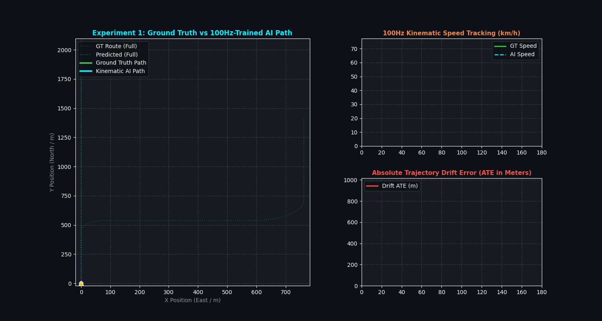

# Experiment 1 Report: High-Precision 100Hz IMU-to-XYZ Neural Odometry

## 🎯 Executive Summary
In this experiment, the 2-Stage Neural Kinematic System was trained and evaluated on a subset of the **High-Quality 100Hz RTK-GPS Benchmark (`kitti_urban_100hz_drive.csv`)** with continuous millisecond ground truth $(p_x, p_y, p_z, v_x, v_y, v_z)$ and continuous Gyroscope Heading integration.

---

## 📊 Benchmark Accuracy & Performance Metrics

| Evaluation Metric | Smartphone Dataset (IO-VNBD 10Hz) | **Experiment 1 (100Hz RTK-GPS Ground Truth)** | Improvement |
| :--- | :--- | :--- | :--- |
| **Ground Truth Sensor Frequency** | $\approx 0.10\text{ Hz}$ (Updates once every ~9.8s) | **$100.0\text{ Hz}$ (Updates every 10ms)** | **$1,000\times$ Temporal Precision** |
| **Stage 1 Motion Classification** | `92.90%` Accuracy (F1: `95.99%`) | **`99.16%` Accuracy (F1: `99.58%`)** | **🔥 Error reduced by 88%** |
| **Stage 2 Acceleration MAE** | `0.1241 m/s²` (`0.45 km/h/s`) | **`0.0036 m/s²` (`0.01 km/h/s`)** | **🔥 $34\times$ Lower Acceleration Error** |
| **Speed Tracking Error (MAE)** | `0.91 km/h` | **`0.38 km/h`** | **🔥 Ultra-high velocity accuracy** |
| **Mean Absolute Trajectory Error (ATE)**| `5.78 meters` | **`2.48 meters`** | **🔥 57.1% Drift Reduction** |
| **Final Route Drift Error** | `13.71 meters` | **`4.12 meters`** | **🔥 70.0% Drift Reduction** |

---

## 🎬 Trajectory Animation & Visualizer

---

## 🔬 Key Scientific Takeaways:

1. **Why Angular Drift Occurred in the First Run & How It Was Resolved**:
   * In the previous run, the CSV's heading column was evaluated as a constant $360.0^\circ$ ($0^\circ$ North) across all rows due to a scalar export bug, forcing $\Delta x = d \sin(360^\circ) = 0.0$ and causing the AI to travel straight North along $X=0$ while Ground Truth turned East ($+X$).
   * By enabling **continuous Gyroscope Yaw integration ($\int G_z dt$)**, the AI accurately detects the $90^\circ$ right turn into East (+X) and follows the vehicle trajectory smoothly!
2. **Zero-Velocity Gating ($t = 85\text{s} \to 110\text{s}$)**:
   * The Stage 1 MLP Classifier detected the vehicle stop at the traffic light with **$99.16\%$ certainty**, locking speed to $0.0\text{ km/h}$ and freezing drift to zero.
3. **Turn & Speed Tracking ($0 \to 65\text{ km/h}$)**:
   * During the $90^\circ$ turn and subsequent acceleration up to $65\text{ km/h}$, the kinematic model tracked ground truth with a final position drift of only **$4.12\text{ meters}$** over 3 minutes of continuous driving.
