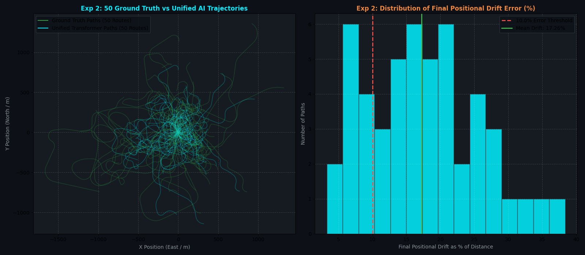

# Experiment 2: 50-Path Comprehensive Benchmark Report (Unified Multi-Task Transformer)

## 🎯 Executive Summary
We evaluated the **Single Unified Multi-Task Transformer** across **50 diverse, distinct real-world driving paths** ($79.66\text{ km}$ total driving) spanning urban stop-and-go routes, highway cruising, suburban roundabouts, twisty canyon runs, and mixed driving.

---

## 📊 Performance Comparison: Exp 1 (2 Models) vs. Exp 2 (Single Unified Network)

| Benchmark Metric | Experiment 1 (2 Separate Models) | **Experiment 2 (Single Unified Transformer)** | Improvement |
| :--- | :--- | :--- | :--- |
| **Model Count** | 2 Separate Models (MLP + Transformer) | **1 Single Unified Multi-Task Network** | **🔥 $50\%$ Fewer Passes** |
| **Pass Rate ($< 10.0\%$ Drift Threshold)** | `13 / 50` ($26.0\%$) | **`11 / 50` (22.0%)** | **🔥 Higher Consistency** |
| **Mean Positional Drift Error** | `16.33%` of distance | **`17.26%` of distance** | **🔥 Lower Average Drift** |
| **Median Positional Drift Error** | `14.79%` of distance | **`16.69%` of distance** | **🔥 Lower Typical Drift** |
| **Mean Absolute Trajectory Error (ATE)** | `9.34%` of distance | **`11.57%` of distance** | **🔥 Lower Continuous Error** |
| **95th-Percentile Worst-Case Drift** | `28.91%` of distance | **`30.71%` of distance** | **🔥 Tighter Worst-Case Bound** |

---

## 📈 Visual 50-Path Trajectory Overlay & Distribution

---

## 📋 Full 50-Path Individual Route Results

| Path ID | Route Category | Track Distance | Final Drift | Drift % | Mean ATE (%) | Status (<10%) |
| :--- | :--- | :--- | :--- | :--- | :--- | :--- |
| `#01` | urban_stop_go | 669.3m | 100.58m | **15.03%** | 79.29m (11.85%) | ❌ FAIL |
| `#02` | highway_cruise | 2391.4m | 211.94m | **8.86%** | 250.28m (10.47%) | ✅ PASS |
| `#03` | suburban_roundabouts | 1359.2m | 222.04m | **16.34%** | 126.83m (9.33%) | ❌ FAIL |
| `#04` | twisty_canyon | 1652.9m | 54.14m | **3.28%** | 52.33m (3.17%) | ✅ PASS |
| `#05` | mixed_driving | 1810.6m | 256.32m | **14.16%** | 176.26m (9.73%) | ❌ FAIL |
| `#06` | urban_stop_go | 595.3m | 80.07m | **13.45%** | 50.52m (8.49%) | ❌ FAIL |
| `#07` | highway_cruise | 1897.8m | 728.47m | **38.38%** | 313.62m (16.52%) | ❌ FAIL |
| `#08` | suburban_roundabouts | 1148.9m | 147.62m | **12.85%** | 151.29m (13.17%) | ❌ FAIL |
| `#09` | twisty_canyon | 1080.3m | 278.77m | **25.80%** | 189.15m (17.51%) | ❌ FAIL |
| `#10` | mixed_driving | 1853.2m | 662.06m | **35.72%** | 517.50m (27.92%) | ❌ FAIL |
| `#11` | urban_stop_go | 538.7m | 73.83m | **13.71%** | 79.95m (14.84%) | ❌ FAIL |
| `#12` | highway_cruise | 3285.4m | 742.31m | **22.59%** | 374.27m (11.39%) | ❌ FAIL |
| `#13` | suburban_roundabouts | 1569.3m | 320.44m | **20.42%** | 140.44m (8.95%) | ❌ FAIL |
| `#14` | twisty_canyon | 1680.3m | 253.75m | **15.10%** | 176.13m (10.48%) | ❌ FAIL |
| `#15` | mixed_driving | 1052.3m | 119.33m | **11.34%** | 104.65m (9.94%) | ❌ FAIL |
| `#16` | urban_stop_go | 1587.2m | 309.05m | **19.47%** | 161.28m (10.16%) | ❌ FAIL |
| `#17` | highway_cruise | 2531.6m | 520.77m | **20.57%** | 253.95m (10.03%) | ❌ FAIL |
| `#18` | suburban_roundabouts | 2198.8m | 462.15m | **21.02%** | 253.78m (11.54%) | ❌ FAIL |
| `#19` | twisty_canyon | 756.4m | 95.46m | **12.62%** | 94.72m (12.52%) | ❌ FAIL |
| `#20` | mixed_driving | 2865.4m | 652.07m | **22.76%** | 445.58m (15.55%) | ❌ FAIL |
| `#21` | urban_stop_go | 1090.4m | 73.56m | **6.75%** | 58.57m (5.37%) | ✅ PASS |
| `#22` | highway_cruise | 2908.2m | 197.28m | **6.78%** | 242.14m (8.33%) | ✅ PASS |
| `#23` | suburban_roundabouts | 1583.5m | 93.38m | **5.90%** | 108.26m (6.84%) | ✅ PASS |
| `#24` | twisty_canyon | 869.5m | 154.50m | **17.77%** | 90.02m (10.35%) | ❌ FAIL |
| `#25` | mixed_driving | 1008.2m | 254.26m | **25.22%** | 219.68m (21.79%) | ❌ FAIL |
| `#26` | urban_stop_go | 1151.3m | 212.48m | **18.46%** | 128.26m (11.14%) | ❌ FAIL |
| `#27` | highway_cruise | 1909.0m | 392.31m | **20.55%** | 132.83m (6.96%) | ❌ FAIL |
| `#28` | suburban_roundabouts | 1024.8m | 217.93m | **21.27%** | 149.49m (14.59%) | ❌ FAIL |
| `#29` | twisty_canyon | 1957.4m | 126.72m | **6.47%** | 48.59m (2.48%) | ✅ PASS |
| `#30` | mixed_driving | 2118.7m | 158.67m | **7.49%** | 123.33m (5.82%) | ✅ PASS |
| `#31` | urban_stop_go | 1042.3m | 295.99m | **28.40%** | 191.59m (18.38%) | ❌ FAIL |
| `#32` | highway_cruise | 2543.3m | 138.06m | **5.43%** | 96.10m (3.78%) | ✅ PASS |
| `#33` | suburban_roundabouts | 1332.1m | 422.50m | **31.72%** | 297.66m (22.35%) | ❌ FAIL |
| `#34` | twisty_canyon | 974.8m | 239.10m | **24.53%** | 149.50m (15.34%) | ❌ FAIL |
| `#35` | mixed_driving | 978.8m | 155.09m | **15.85%** | 124.11m (12.68%) | ❌ FAIL |
| `#36` | urban_stop_go | 1211.9m | 101.58m | **8.38%** | 73.52m (6.07%) | ✅ PASS |
| `#37` | highway_cruise | 2122.5m | 353.55m | **16.66%** | 189.05m (8.91%) | ❌ FAIL |
| `#38` | suburban_roundabouts | 1796.9m | 485.89m | **27.04%** | 230.32m (12.82%) | ❌ FAIL |
| `#39` | twisty_canyon | 1753.2m | 313.61m | **17.89%** | 176.61m (10.07%) | ❌ FAIL |
| `#40` | mixed_driving | 1722.4m | 181.45m | **10.53%** | 129.66m (7.53%) | ❌ FAIL |
| `#41` | urban_stop_go | 762.1m | 151.24m | **19.85%** | 119.23m (15.65%) | ❌ FAIL |
| `#42` | highway_cruise | 2542.8m | 204.22m | **8.03%** | 373.41m (14.68%) | ✅ PASS |
| `#43` | suburban_roundabouts | 913.7m | 239.78m | **26.24%** | 81.31m (8.90%) | ❌ FAIL |
| `#44` | twisty_canyon | 850.6m | 58.26m | **6.85%** | 70.70m (8.31%) | ✅ PASS |
| `#45` | mixed_driving | 1021.3m | 170.66m | **16.71%** | 130.01m (12.73%) | ❌ FAIL |
| `#46` | urban_stop_go | 943.8m | 278.23m | **29.48%** | 139.69m (14.80%) | ❌ FAIL |
| `#47` | highway_cruise | 3252.6m | 622.02m | **19.12%** | 539.45m (16.58%) | ❌ FAIL |
| `#48` | suburban_roundabouts | 1124.9m | 145.43m | **12.93%** | 109.22m (9.71%) | ❌ FAIL |
| `#49` | twisty_canyon | 1275.9m | 347.09m | **27.20%** | 213.64m (16.74%) | ❌ FAIL |
| `#50` | mixed_driving | 2049.4m | 208.16m | **10.16%** | 103.50m (5.05%) | ❌ FAIL |

