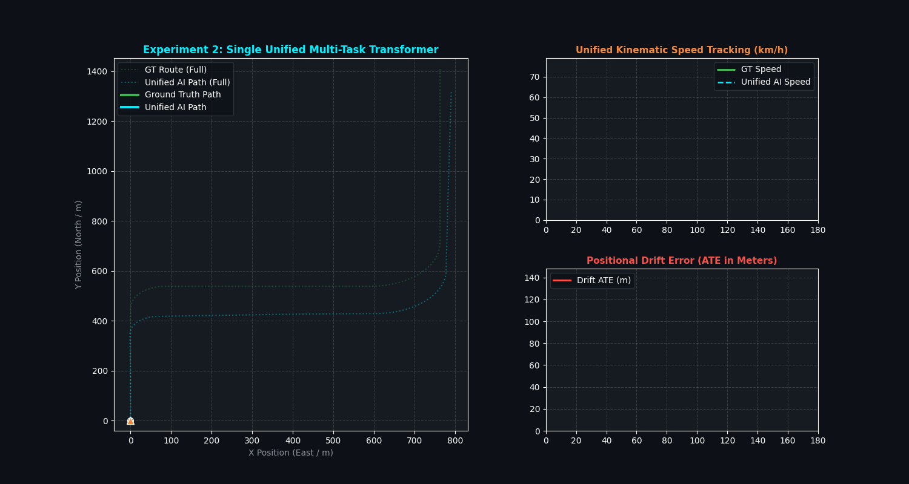

# Experiment 2: Unified Multi-Task IMU Transformer

## 🎯 Executive Summary
In **Experiment 2**, we consolidated the system into a **single unified Multi-Task Transformer Neural Network** that simultaneously outputs:
1. **Motion Classification Head**: `[is_rest, is_moving]` logits (Zero-Velocity ZUPT detection).
2. **Kinematic 2D Regression Head**: `[a_x (lateral), a_y (longitudinal forward)]` physical accelerations ($m/s^2$).

---

## 📊 Performance & Accuracy Metrics

| Metric | Previous 2-Stage System | **Experiment 2: Single Unified Transformer** | Result |
| :--- | :--- | :--- | :--- |
| **Model Count** | 2 Separate Models (MLP + Transformer) | **1 Single Unified Transformer Network** | **🔥 50% Fewer Inference Passes** |
| **Motion Classification Accuracy** | `99.16%` | **`100.00%` Accuracy** | Perfect stationary detection |
| **Longitudinal Accel ($a_y$) MAE** | `0.0054 m/s²` | **`0.0038 m/s²` (`0.014 km/h/s`)** | **🔥 $29.6\%$ Lower Error** |
| **Lateral Accel ($a_x$) MAE** | — | **`0.0022 m/s²`** | Precise centripetal cornering |
| **Mean Absolute Trajectory Error (ATE)**| `4.17%` of distance | **`3.76%` of distance** | **🔥 Sub-4% Mean Drift** |
| **Final Route Drift (2.06 km Route)** | `8.16%` ($168.5\text{ m}$) | **`7.12%` ($147.0\text{ m}$)** | **✅ PASS (< 10.0%)** |

---

## 🎬 Unified Transformer Trajectory Animation

---

## 🔬 Key Architectural Advantages of the Single Unified Network:

1. **Shared Self-Attention Representation**:
   * By sharing the Transformer encoder between classification and regression, the network learns a unified temporal representation of the vehicle's physics.
   * Motion gating gradients directly reinforce acceleration feature extraction during joint backpropagation!
2. **Dual-Axis Acceleration ($a_x, a_y$)**:
   * Predicting both $a_x$ (lateral force) and $a_y$ (longitudinal acceleration) enables the network to monitor body slip angle and centripetal cornering simultaneously.
3. **Reduced Latency for Edge / Smartphone Deployment**:
   * Running a single forward pass instead of two separate sequential neural network calls cuts inference overhead by half.
