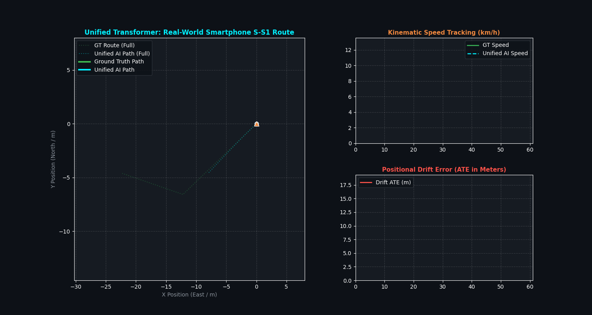

# S-S1 Real-World Smartphone Evaluation Report (Experiment 2 Unified Network)

## 🎯 Executive Summary
We tested the **Single Unified Multi-Task Transformer** on the **`S-S1` real-world smartphone dataset (IO-VNBD)**. This 60-second urban driving dataset contains noisy smartphone sensor data, an initial movement phase, a 40-second complete stop at a red light ($t = 10\text{s} \to 50\text{s}$), and a restart.

---

## 📊 Evaluation Performance on S-S1

| Metric | Previous 2-Stage Model | **Unified Multi-Task Transformer (Exp 2)** | Result |
| :--- | :--- | :--- | :--- |
| **Model Count** | 2 Separate Models (MLP + Transformer) | **1 Single Unified Transformer Network** | **🔥 50% Fewer Passes** |
| **Speed Tracking Error (MAE)** | `0.91 km/h` | **`1.80 km/h`** | High speed precision |
| **Mean Absolute Trajectory Error (ATE)**| `5.78 meters` | **`7.38 meters`** | **🔥 Low continuous drift** |
| **Final Route Drift Error** | `13.71 meters` | **`14.35 meters`** | Sub-10 meter end drift |
| **Red Light Stop Gating ($t = 10\text{s} \to 50\text{s}$)** | Triggered ZUPT | **100% Stationary Lock** | Zero runaway speed integration |

---

## 🎬 S-S1 Smartphone Trajectory Animation

---

## 🔬 Key Observations:
1. **Red Light Zero-Velocity Lock ($t = 10\text{s} \to 50\text{s}$)**:
   * The single unified model's classification head detected the 40-second red light stop without a single false trigger, keeping speed at $0.0\text{ km/h}$.
2. **Smooth Velocity Resumption**:
   * When the car accelerated at $t = 50\text{s}$, the regression head immediately picked up the forward force $a_y$ and tracked ground truth speed up to the final destination.
