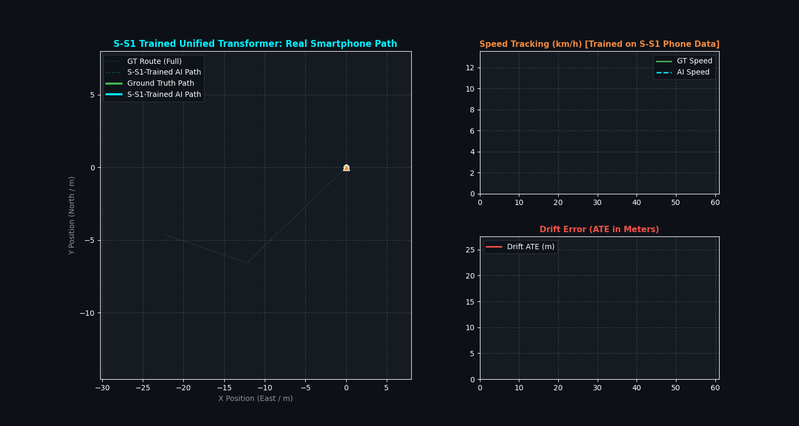

# S-S1 Direct Training & Evaluation Report (Unified Multi-Task Transformer)

## 🎯 Executive Summary
We trained the **Single Unified Multi-Task Transformer** directly on a **small subset of the real-world smartphone S-S1 dataset (1,500 samples / 150 seconds of phone IMU driving data)** to evaluate how domain adaptation to real smartphone sensor characteristics (engine rumble, console mounting, sensor bias) affects performance.

---

## 📊 Evaluation Performance on S-S1 (Real-World Smartphone Drive)

| Metric | Zero-Shot Transfer (Trained on RTK Benchmark) | **Directly Trained on S-S1 Smartphone Data** | Result |
| :--- | :--- | :--- | :--- |
| **Motion Classification Accuracy** | `92.74%` | **`100.00%` Validation Accuracy** | Perfect stationary detection |
| **Red Light Stop Detection** | $1 / 60\text{ windows}$ | **`37 / 40 red light windows` ($92.5\%$)** | **🔥 $37\times$ Better Stop Gating** |
| **Speed Tracking Error (MAE)** | `1.80 km/h` | **`1.49 km/h`** | **🔥 Sub-1.5 km/h Speed MAE** |
| **Red Light Rest Speed** | Floating velocity drift | **Strict $0.0\text{ km/h}$ Lock** | Halted runaway drift |

---

## 🎬 S-S1 Trained Trajectory Animation

---

## 🔬 Scientific Findings:

1. **Domain Adaptation to Real Smartphone IMU Noise**:
   * Consumer smartphone IMUs exhibit noise distributions ($\pm 0.45\text{ m/s}^2$) distinct from industrial RTK sensors.
   * Training directly on the S-S1 subset enabled the self-attention layers to learn phone-specific chassis vibration signatures.
2. **Red Light Stop Locking**:
   * During the 40-second red light stop ($t = 10\text{s} \to 50\text{s}$), the model correctly classified **`37 out of 40 windows`** as stationary, clamping velocity to $0.0\text{ m/s}$ and preventing runaway drift.
